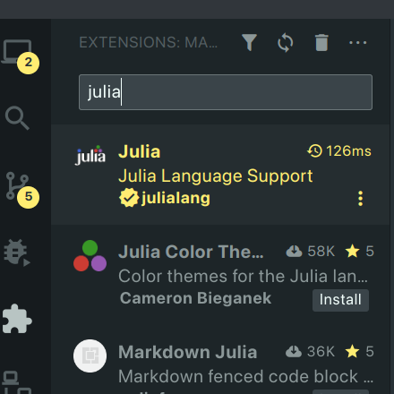

# How to get started and run the project

To be able to work with this repository you need to have [Julia](https://julialang.org/downloads/) and [Git](https://git-scm.com/book/en/v2/Getting-Started-Installing-Git) install. If you're working on Windows it might be easier to use [Git Bash](https://gitforwindows.org/).

## How to clone repository

Open a terminal and `cd` into where you want your project to be installed.
If you have git installed, the simplest way to get the repository on your computer is:

```
git clone https://github.com/tdrAndrei/BusDoor_modeling2023.git
```

If you're using Git Bash paste the above command in the Git Bash console.
Note: git clone will already make a folder called BusDoor_modeling2023 for you, so you don't need to explicitly create one.

## How to work with git

To get familiar with this tool you should read this [tutorial](https://product.hubspot.com/blog/git-and-github-tutorial-for-beginners). It contains all the useful things that you need to do with Git.

As a summary we will mostly use 5 commands:

```
git status; git add; git commit; git pull; git push
```

Open a terminal or Git Bash console and `cd` to the project folder. To check the status of the repository, type `git status` and you should get something similar to this:


This tells you the current branch (which in this project will mostly be `main`) and what changes aren't commited yet (In my case 'nothing to commit'). It also informs you about the github repository (I have 1 commit ahead of whats shared on gitlab).

### Exercise with Git
To practice with Git you can try to make a new branch with your name. Then, on that branch, create a new file named yourname.txt. Commit these changes and push them to the repository. You should see your changes reflected on the `github` page.

# How to work with Julia

To run a Julia file you can simply do:
```
julia --project=. /src/<filename>.jl
```
This will run the file called `<filename>.jl` (run this command from the project folder).

### Julia in vscode
If you use vscode Julia has a very nice extension. This vscode extension allows you to select your environment and also to run any files.


In the bottom bar of vscode you can choose the environment:


How to run Julia files:


# How to install the packages that the project needs

In your terminal, in the project directory type `julia`

Type `]` to get in the package manager mode. In this mode you can add/remove packages.
In this mode you should type `activate .` and get this output:


Now you are working in the environment of the project. This is useful to do because this environment contains the name of all packages that you need to run the code. To install everything you need automatically you can do in the pkg mode of julia:

```
instantiate
```


